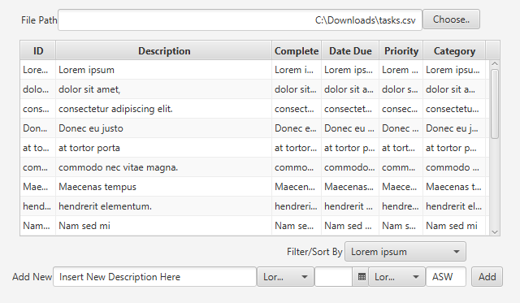

# Task Manager 📝👩🏻‍💻🚩📋🎯✔️

Objectives:

In this homework you will:

* Collaborate with others using a shared repo
* Design a solution with Model-View architecture
* Develop sortable custom objects
* Use design patterns to solve common problems
* Meet objectives of prior assignments
* Implement Swing to create Model-View applications

## Group Directions

Pick your own teams up to three (3) people. Submitting as an individual will result in an automatic zero; unless other members were missing in action -- but contact the teaching team at the first sign of trouble.

Each individual member should create their own branch while working on this assignment. Only merge to the main branch when you're confident that your code is working well. You may submit pull requests and merge to main as often as you like.

It is recommended that you practice merging with your group early on, before you get too deep into the assignment. Getting comfortable with collaborating on GitHub can be painful so don't underestimate this part of the assignment! Two important tips: pull from main before creating a branch and avoid editing files/code that others are also working on.

To submit your work, push it to GitHub and create a release on your main branch. Only one person needs to create the release.

## Instructions

Amazin has been thouroughly impressed by your work and they want you to assist with a new project management tool that will help to organize tasks. Your role is to build a command-line Task application. The system will allow a user to add and track the status of their Tasks by due date, category, priority, and status (complete/incomplete).

The application stores all Tasks in a CSV file. The CSV file is a plain text file containing data organized into columns separated by a comma. The first line of the file contains the headers for each column. The CSV has 6 columns named `id`, `text`, `completed`, `due`, `priority`, and `category`. You can assume that the CSV column names will not change. Here's an example:

```csv
id,text,completed,due,priority,category
1,Fix Bug 1234 in ZIP code validator,false,2023/22/08,HIGH,Preme
2,Create Mock-up for new View in Grocery Mobile App,false,2023/30/09,MEDIUM,Grocery
3,Organize Code Review with ASW� On-line� and Marketing teams for new version of website,false,,,
```

It is possible that descriptions entries may contain representations of commas. For example, on row 3 in the listing above, `Organize Code Review with ASW� On-line� and Marketing teams` contains a special character `�` that is meant to be a replacement character. When presented to the user, this should be replaced with a comma. When saved into a csv, any string that contains a `,` should have it replaced with `�`.

Some columns are considered optional and may not contain data. A cell that contains no characters means that there is no value for this cell (you should not store an empty value in your objects). You can see an example on the last line that no due date, priority, nor category have been set for Task #3. This data is also saved inside of [sampledata.csv](sampledata.csv).

A `Task` consists of the following information:

* `text` - a description of the task to be done. This field is required.
* `completed` - indicates whether the task is completed or incomplete. If not specified, this field should be `false` by default. However, it should be possible to create a new `Task` with completed set to true.
* `due` - a due date. This field is optional.
* `priority` - an enummerated type indicating the priority of the `Task` of `HIGH`, `MEDIUM`, or `LOW`. This field is optional. If no priority is specified, the `Task` can be treated as `LOW`.
* `category` - a user-specified String that can be used to group related `Tasks`, e.g.,
"Preme", "ASW", "Grocery", etc. This field is optional.

Once a `Task` is created, all fields should be immutable, with the exception of `completed`. In the system, each Task will also have an integer `ID` that the user can use to update the completion status of an individual `Task` (see below). You may choose how and where to generate and track the `ID`. Generating the `ID` should not be the user's responsibility.

### Functionality

The system must support the following functionality:

* Add a new `Task`. The user must supply the information required by the `Task` data structure. They can also choose to specify the optional information. When a new `Task` is added, the CSV file should be updated.
* Complete an existing `Task`. The user set the completed status of an existing `Task` to true. When the status is changed, the CSV file should be updated.
* Display `Task`s. The user can request that the program display a list of `Task`s. You may choose how to format the list, but make sure it's user friendly! By default, all of the Tasks should be printed but they can supply additional arguments to customize the list:

  * Filter the list to only include incomplete `Task`s
  * Filter the list to only include `Task`s with a particular category
  * Sort the `Task`s by date (ascending)
  * Sort the `Task`s by priority (ascending)

  The two filter arguments can be combined but only one sort can be applied at a time. For example, the user could request all incomplete `Task`s with category, "Preme", sorted by date but the user cannot request all incomplete `Task`s sorted by date AND priority. When sorting by date, there may be `Task`s that do not have a due date. These `Task`s should come after all `Task`s that do have a due date.

Your program should accept the following command line arguments in any order:

* `--help` Provide a brief description of all of the supported commands.
* `--help <command>` Provide a full description of the command and additional info required for that command.
* `--csv-file <path/to/file>` The CSV file containing the `Task`s. This option is required unless printing help.
* `--add-Task` Add a new Task. If this option is provided, then `--Task-text` must also be provided.
* `--Task-text <description of Task>` A description of the `Task`.
* `--completed` (Optional) Sets the completed status of a new `Task` to true.
* `--due <due date>` (Optional) Sets the due date of a new `Task`. You may choose how the date should be formatted.
* `--priority <1, 2, or 3>` (Optional) Sets the priority of a new `Task`. The values represent LOW, MEDIUM, or HIGH.
* `--category <a category name>` (Optional) Sets the category of a new Task. The value can be any String. Categories do not need to be pre-defined.
* `--complete-Task <id>` Mark the Task with the provided ID as complete.
* `--display` Display `Task`s. If none of the following optional arguments are provided, displays all `Task`s.
  * `--show-incomplete` (Optional) If --display is provided, only incomplete `Task`s   should be displayed.
  * `--show-category <category>` (Optional) If --display is provided, only `Task`s with the given category should be displayed.
  * `--sort-by-date` (Optional) If --display is provided, sort the list of `Task`s by date order (ascending). Cannot be combined with --sort-bypriority.
  * `--sort-by-priority` (Optional) If --display is provided, sort the list of Tasks   by priority (ascending). Cannot be combined with --sort-by-date.

A user can request the program perform all three tasks (add, complete, and display) in one run of the program. They may only add one Task at a time, but they may complete multiple Tasks by repeating the `--complete-Task` option for each Task to complete. E.g. `--completeTask 5 --complete-Task 2` would complete the Task with ID 5 and the Task with ID 2.

When a user provides an illegal combination of inputs, the program should exit with a helpful error message, and a short explanation of how to use the program along with examples. If the user attempts to complete a Task that does not exist or display a subset of Tasks that returns no results, the program should also provide feedback to the user.

**Important**: This program will have a lot of IO and perform a lot of interaction with the user which can lead to a lot of unexpected behavior. Your code needs to account for safety and not crash in the face of malformed data; trying, catching, and handeling any exceptions gracefully.

## Documentation and Testing

Your project needs to follow the Google style format and reach 70% code coverage from your testing. You are expected to show a screenshot from your JaCoCo coverage report below, identifying the level of code coverage. Use the command rendered below in order to have it display on GitHub.

```markdown
Image Rendering Syntax:


Example:

```

// add your screenshot here

## UML

// add a UML Class Diagram written in Mermaid here

## Reflection

1. Suppose that a user enters a task description of "Implement Feature #P0123, add unit testing, and add proper Javadoc." How would this be saved into the file and why is it saved that way?
2. Explain why this application did not use the C part of MVC.
3. What attribute is missing from the `Task` that needs to be included?
4. Describe what would have to change within the Model if you were to make this a Swing application instead of one that used the terminal.
5. Identify which named design patterns you used, where, and why - as part of the following table (at least 4):

  | Pattern Name | Class(es) | Justification |
  | :--------: | ------- | :------- |
  | ExamplePattern1 | `Listing`, `Agent` | This pattern allowed for a seperation of duties between the different types of `Property` so that the `Agent` could list multiple types of `Property` without needing to be concerned with the type or writting special code inside of `Listing` following the guidance of encapsulating tasks. |
  | Pattern2 | `ClassX`, `ClassY`, `ClassZ` | Insert full justification here |
  | Pattern3 | `ClassA`, `ClassB` | Insert full justification here |
  | Pattern4 | `ClassA`, `ClassC` | Insert full justification here |
  | Pattern5 | `ClassB`, `ClassD` | Insert full justification here |
  
## Accountability

In this section, identify who worked on what parts.

## Optional Extra Credit

**Important** This task can only be completed *after* you've fully implemented the command line version of this homework. It also must exist along-side the visual version, meaning that the user should still be able to use the terminal version using the same codebase if they want to. It simply is organized so that the View isn't a terminal -- but is instead a Swing Application that does the same thing.

Here is an example of what your program might look like (it does not have to look exactly like this, just something to get you started).



We haven't discussed unit testing on Views and Controllers so do not worry about this for now. It may disrupt your code coverage percentages so if that happens then clearly identify which files were part of your View/Controller and should be excluded from your overall code coverage.

Your Swing application should provide the same, or nearly the same, functionality as the terminal version and needs to be implemented using all of the principles of proper MVC and Object Oriented Design as well as use Design Patterns where appropriate. In order to run the Swing application, have the user enter no command-line arguments or create a custome option like `--launch-gui`.

Finally, in order to receive this extra credit, you must demo your code through a codewalk during Office Hours or contact the teaching team to make an appointment outside OH.
